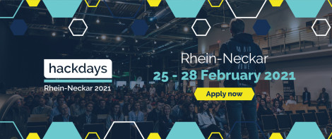

Pepperl+Fuchs as well as certainly many other hardware manufactures are implementing new Industry4.0 and IIoT concepts in their production to make their business overall more profitable. Whereas in
the actual manufacturing process many - if not all - steps are already automated, the full potential for
further automation in intralogistics is still to be leveraged.

At Hackdays Rhein-Neckar 2021, we are looking for a smart solution in order to monitor the flow of
materials within such a manufacturing process. Automatic transportation of boxes and carriers are
often done by conveyor belts which guide the goods to their destination. To increase transparency and
efficiency in this process, we are looking for a Lidar-driven solution to autonomously monitor these
belts..

## The Challenge
At any given time, the monitoring system shall give an overview of how many and what kind of boxes
have been transported on a certain belt. By using 2D Lidar Scanners by Pepperl+Fuchs we provide you
access to the latest laser technologies when it comes to distance measurements. The R2000 is a 2D
Lidar scanner with a 360°-angle of measurement making use of pulse ranging technology and is capable of angular divergence of 10 mrad transversal and 2mrad longitudinal. Find the most suitable way to
classify the boxes that have been on a certain belt and get creative

---

## The Experimental Setup

## Visualizing Lidar Data

Initial K Means clustering of single scan data to determine seperability of features

## Method 1: RBF Resampling + Support Vector Machines

Classification Accuracy: 43%

## Method 2: PoinNet Point Cloud Classification